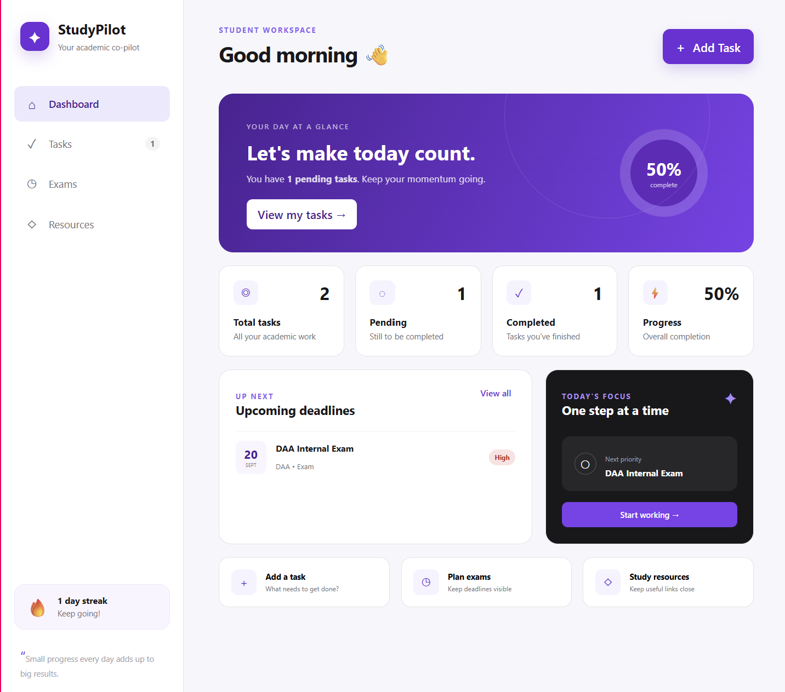
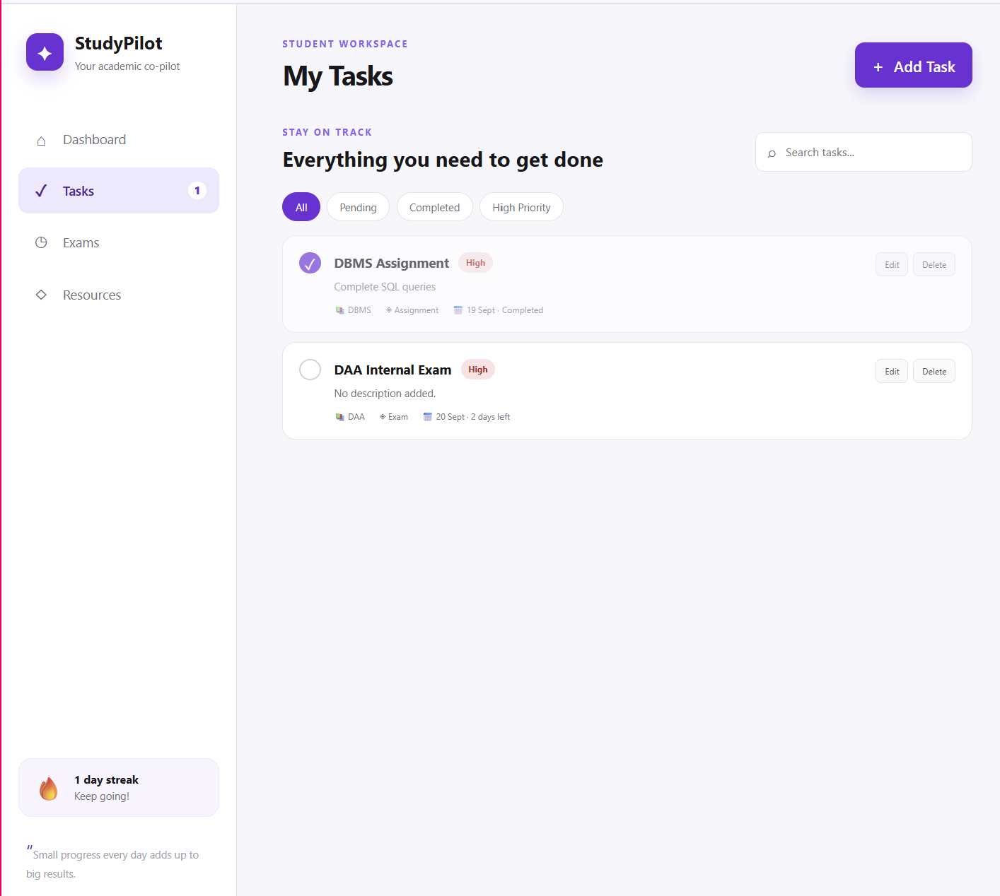
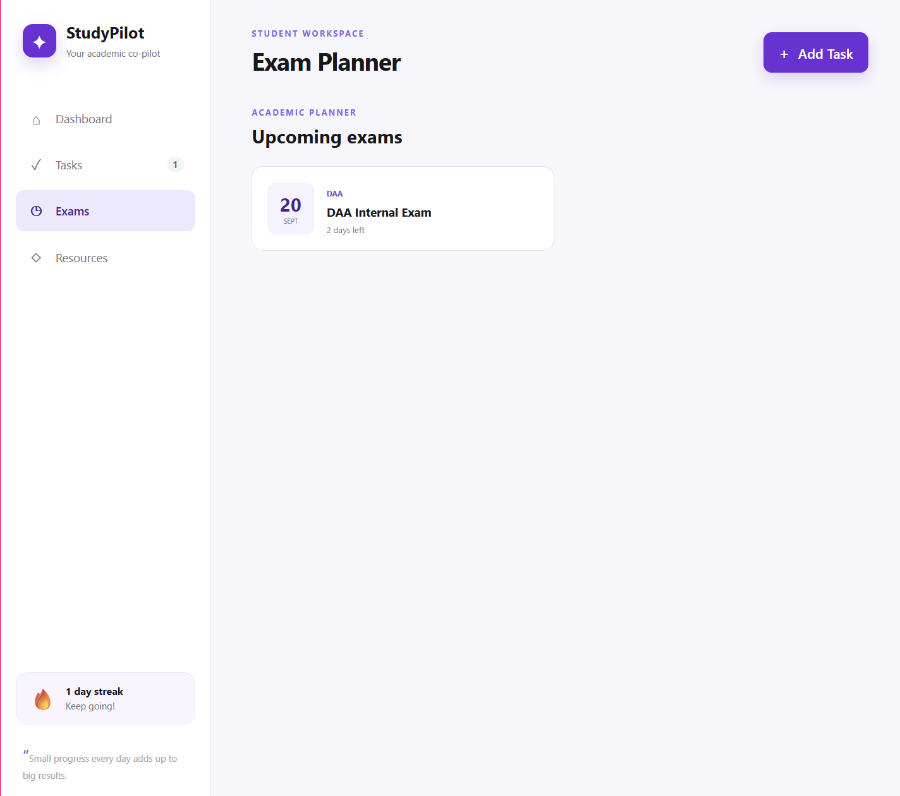
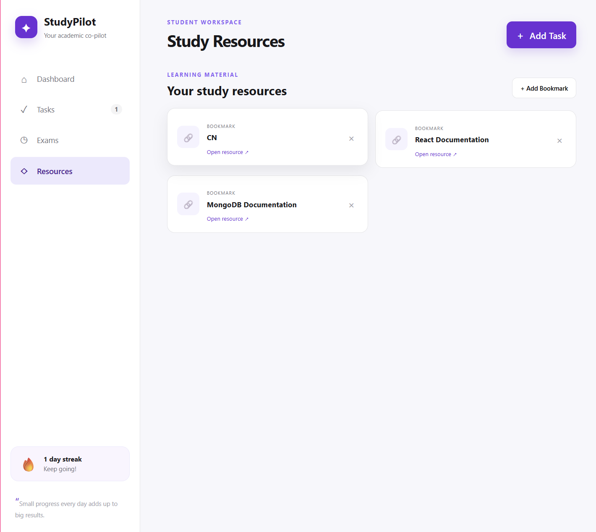
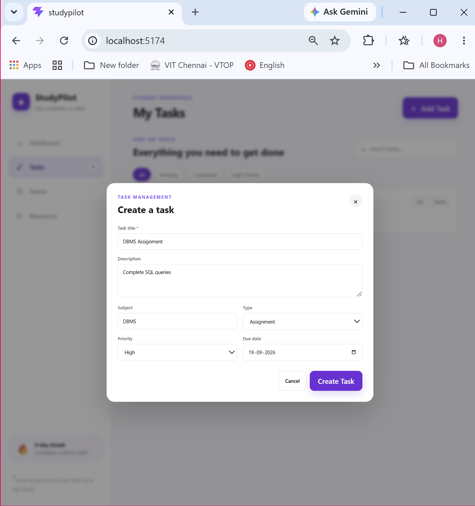

# StudyPilot

### Your academic co-pilot.

StudyPilot is a student-focused academic task management and productivity application designed to help students organize assignments, exams, revision work, projects, deadlines, and study resources in one place.

It provides a clean academic workspace with task management, subject-based organization, priority tracking, exam tracking, productivity insights, resource bookmarking, search, and filtering.

The application uses a **React + Vite frontend**, **Node.js + Express backend**, and **MongoDB Atlas** for persistent task storage.

---

## ✨ Features

### 📋 Task Management

* Create tasks
* Edit existing tasks
* Delete tasks
* Mark tasks as completed
* Mark completed tasks as pending
* Add task descriptions
* Assign subjects
* Set task types
* Set priorities
* Add due dates

### 📚 Academic Task Types

Tasks can be categorized as:

* Assignment
* Exam
* Revision
* Project
* General

### 🚦 Priority Management

Each task can have one of three priority levels:

* 🔴 High
* 🟡 Medium
* 🟢 Low

### 📊 Dashboard

The dashboard provides a quick overview of the student's academic workload.

It includes:

* Total tasks
* Completed tasks
* Pending tasks
* Completion progress
* Upcoming deadlines
* Today's Focus
* Quick actions
* Productivity streak

### 📝 Exam Tracking

Tasks categorized as **Exam** are automatically displayed in the dedicated Exams section.

This provides students with a focused view of upcoming academic assessments.

### 🔎 Search & Filtering

The Tasks page supports:

* Task search
* All tasks
* Pending tasks
* Completed tasks
* High-priority tasks

### 🔥 Productivity Streak

StudyPilot tracks task completion using completion timestamps.

When a task is completed, the backend records the completion time and the application uses this information to display a productivity streak.

### 🔗 Resources

The Resources section allows students to save useful academic resources.

Each resource can contain:

* Title
* Subject
* Description
* URL

### 📱 Responsive UI

The application includes:

* Clean sidebar navigation
* Dashboard cards
* Task cards
* Modal-based task creation and editing
* Search and filter controls
* Responsive layouts
* Hover interactions
* Clear visual hierarchy

---

# 📸 Screenshots

## Dashboard



The dashboard provides an overview of tasks, completion progress, upcoming deadlines, Today's Focus, and productivity information.

---

## Tasks



The Tasks page provides the main task management interface for creating, editing, completing, deleting, searching, and filtering academic tasks.

---

## Exams



The Exams section provides a dedicated view of tasks categorized as exams.

---

## Resources



The Resources section allows students to save and organize useful academic links.

---

## Task Window



The task window is used to create and edit tasks with details such as title, description, subject, task type, priority, and due date.

---

# 🛠️ Tech Stack

### Frontend

* React
* Vite
* JavaScript
* HTML5
* CSS3

### Backend

* Node.js
* Express.js

### Database

* MongoDB Atlas
* Mongoose

### Development Tools

* Visual Studio Code
* Git
* GitHub
* npm
* MongoDB Atlas

---

# 🏗️ Application Architecture

StudyPilot follows a simple three-layer architecture.

```text
┌───────────────────────────┐
│      React Frontend       │
│       Vite + React        │
└─────────────┬─────────────┘
              │
              │ REST API
              ▼
┌───────────────────────────┐
│      Express Backend      │
│      Node.js + Express    │
└─────────────┬─────────────┘
              │
              │ Mongoose
              ▼
┌───────────────────────────┐
│       MongoDB Atlas       │
│       Cloud Database      │
└───────────────────────────┘
```

### Frontend

The React frontend handles:

* User interface
* Task forms
* Task display
* Search
* Filtering
* Dashboard calculations
* Navigation
* User interactions

### Backend

The Express.js backend handles:

* REST API requests
* Task creation
* Task updates
* Task deletion
* Completion status
* Database communication

### Database

MongoDB Atlas provides persistent storage for task information.

---

# 🔄 Data Flow

When a student creates a task, the data follows this flow:

```text
Student
   │
   ▼
Task Window
   │
   ▼
React Frontend
   │
   │ POST /api/tasks
   ▼
Express Backend
   │
   │ Mongoose
   ▼
MongoDB Atlas
   │
   │ Stored Task
   ▼
Express Backend
   │
   ▼
React Frontend
   │
   ▼
Updated Task List
```

The same architecture is used for editing, completing, and deleting tasks.

---

# 🗄️ Database Design

StudyPilot uses MongoDB Atlas for persistent task storage.

Each task contains fields including:

| Field         | Description                                     |
| ------------- | ----------------------------------------------- |
| `title`       | Name of the task                                |
| `description` | Additional task details                         |
| `subject`     | Academic subject                                |
| `type`        | Assignment, Exam, Revision, Project, or General |
| `priority`    | High, Medium, or Low                            |
| `dueDate`     | Task deadline                                   |
| `completed`   | Completion status                               |
| `completedAt` | Completion timestamp                            |
| `createdAt`   | Task creation timestamp                         |
| `updatedAt`   | Last update timestamp                           |

Mongoose is used to define the task schema and communicate with MongoDB Atlas.

---

# 🔌 REST API

The backend provides REST APIs for task management.

| Method   | Endpoint                  | Description             |
| -------- | ------------------------- | ----------------------- |
| `GET`    | `/api/tasks`              | Fetch all tasks         |
| `POST`   | `/api/tasks`              | Create a new task       |
| `PUT`    | `/api/tasks/:id`          | Update an existing task |
| `DELETE` | `/api/tasks/:id`          | Delete an existing task |
| `PATCH`  | `/api/tasks/:id/complete` | Toggle task completion  |

## API Details

### Get All Tasks

```http
GET /api/tasks
```

Retrieves all tasks stored in MongoDB.

### Create Task

```http
POST /api/tasks
```

Creates and stores a new task.

### Update Task

```http
PUT /api/tasks/:id
```

Updates an existing task using its MongoDB document ID.

### Delete Task

```http
DELETE /api/tasks/:id
```

Deletes a task from the database.

### Toggle Completion

```http
PATCH /api/tasks/:id/complete
```

Toggles the task's completion status.

When a task is completed, the backend records its completion timestamp.

---

# 📁 Project Structure

```text
StudyPilot/
│
├── backend/
│   ├── .gitignore
│   ├── package.json
│   ├── package-lock.json
│   └── server.js
│
├── public/
│
├── screenshots/
│   ├── dashboard.png
│   ├── tasks.png
│   ├── exams.png
│   ├── resources.png
│   └── task_window.png
│
├── src/
│   ├── App.jsx
│   ├── App.css
│   ├── index.css
│   └── main.jsx
│
├── .gitignore
├── index.html
├── package.json
├── package-lock.json
├── README.md
└── vite.config.js
```

---

# 🚀 Getting Started

## Prerequisites

Make sure the following are installed:

* Node.js
* npm
* Git
* MongoDB Atlas account

## 1. Clone the Repository

```bash
git clone https://github.com/hareeshanellakara-git/StudyPilot.git
cd StudyPilot
```

## 2. Install Frontend Dependencies

From the project root:

```bash
npm install
```

## 3. Install Backend Dependencies

Move into the backend directory:

```bash
cd backend
npm install
```

---

# 🔐 Environment Variables

Create a `.env` file inside the `backend` directory.

```env
MONGO_URI=your_mongodb_connection_string
PORT=5000
```

Your backend folder should look like:

```text
backend/
├── .env
├── .gitignore
├── package.json
├── package-lock.json
└── server.js
```

> **Important:** Never commit the `.env` file or expose your MongoDB credentials publicly.

The project `.gitignore` files exclude environment files and dependency folders from version control.

---

# ▶️ Running the Application

The frontend and backend run separately during local development.

## Start the Backend

From the `backend` directory:

```bash
node server.js
```

The backend runs on:

```text
http://localhost:5000
```

The server connects to MongoDB Atlas before starting the API.

## Start the Frontend

Open another terminal in the project root:

```bash
npm run dev
```

The frontend runs on:

```text
http://localhost:5173
```

Open the frontend URL in your browser to use StudyPilot.

---

# ⚙️ How StudyPilot Works

## Creating a Task

1. The student opens the **Tasks** page.
2. The student selects **Add Task**.
3. Task information is entered in the task window.
4. React sends the data to the Express API.
5. Express processes the request.
6. Mongoose stores the task in MongoDB Atlas.
7. The backend returns the stored task.
8. The React interface updates the task list.

## Editing a Task

1. The student selects **Edit** on an existing task.
2. The task window opens with the existing information.
3. The student modifies the required fields.
4. React sends an update request to the backend.
5. Express updates the MongoDB document.
6. The updated task is returned to the frontend.

## Completing a Task

1. The student marks a task as completed.
2. React sends a completion request.
3. The backend updates the `completed` field.
4. The backend records `completedAt`.
5. The updated task is returned to the frontend.
6. Dashboard statistics and productivity information are updated.

## Deleting a Task

1. The student selects the delete option.
2. React sends a `DELETE` request.
3. Express removes the task from MongoDB.
4. The updated task list is displayed.

---

# 💡 Key Design Decisions

## Student-Centered Task Categories

StudyPilot uses academic-specific task categories instead of treating every task as a generic item.

Assignments, exams, revision work, and projects can be organized separately.

## MongoDB Atlas for Persistence

MongoDB Atlas provides cloud-based persistent storage.

Using a database instead of browser-only storage allows task data to remain available after refreshing the application.

## REST API Architecture

The frontend communicates with the backend through REST APIs.

This separates the user interface from database operations and makes the application easier to maintain and extend.

## Focused User Experience

The application focuses on common student workflows:

* Add academic work
* Organize tasks
* Track deadlines
* Complete tasks
* Monitor progress
* Track exams
* Save study resources

The interface is designed to keep important academic information accessible without unnecessary complexity.

---

# 🔒 Security Considerations

* MongoDB credentials are stored using environment variables.
* `.env` files are excluded from Git.
* Database credentials are not included in frontend code.
* Backend configuration is separated from source code.
* `node_modules` is excluded from version control.

---

# 🔮 Future Improvements

Potential future enhancements include:

* User authentication
* Individual student accounts
* Cloud-based file uploads for study notes
* Cloud file storage
* Calendar integration
* Task reminders and notifications
* Recurring tasks
* Advanced productivity analytics
* Detailed academic progress tracking
* Drag-and-drop task organization
* Mobile-focused improvements
* Production deployment

---

# 📚 Learning Outcomes

Developing StudyPilot provided practical experience with:

* React development
* Component-based UI design
* React state management
* REST API integration
* Node.js
* Express.js
* MongoDB Atlas
* Mongoose
* CRUD operations
* Frontend-backend communication
* Environment variables
* Git and GitHub
* Responsive web development

---

# 👤 Author

**Hareesha N**

B.Tech Computer Science and Engineering

---

# 📄 License

This project is developed for educational and personal portfolio purposes.
